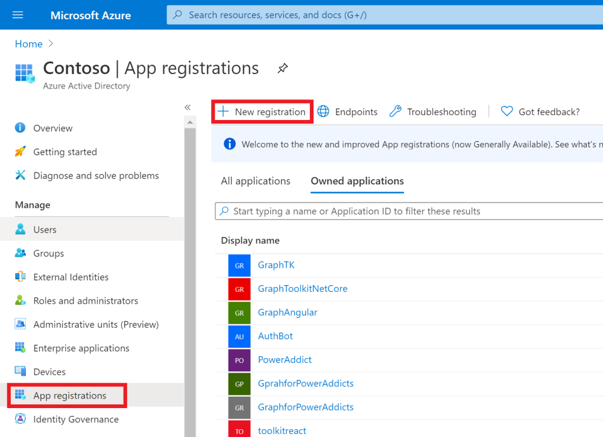
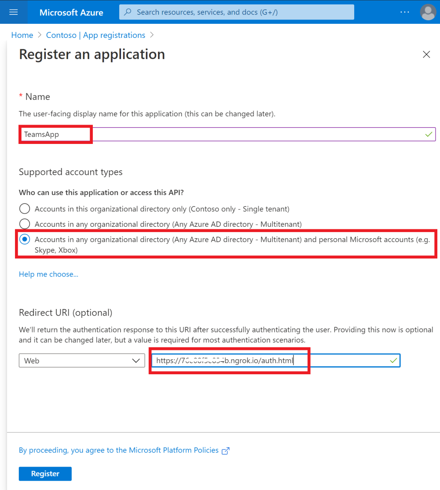

## Part 2 - Register your application in Azure Active Directory

- [Part 0 - Environment Setup](00-Setup.md) 
- [Part 1 - Create a new Teams custom tab](01-Create_Teams_tab.md) 
- [Part 2 - Register your application in Azure Active Directory](02-Register_your_app_in_Azure_AD.md) (**You are here**)
- [Part 3 - Add Microsoft Graph Toolkit and build the auth pop-up page](03-Initialize_MGT_and_auth_page.md)
- [Part 4 - Design your One Productivity Hub using Microsoft Graph Toolkit components](04-Design_your_tab_using_MGT_components.md)
- [Part 5 - Test your tab in Microsoft Teams App Studio](05-Test_your_tab.md)

1. Go to [Azure Portal](https://portal.azure.com), then **Azure Active Directory > App Registration** and select **New Registration**.

    

1. Fill the details to register an app:
   * give a name to your application
   * select **Accounts in any organizational directory** as an access level
   * place **auth-popup-url** as the redirect url `https://<YOUR_NGROK_URL>/auth.html`
   * select **Register**
   
     

1. Go to **Authentication** tab and enable **Implicit grant** by selecting `Access tokens` and `ID tokens`, then click `Save` button on the top of the page.

    
   
1. Go to **Overview** tab and copy **Application (client) ID**.

## References
- Microsoft Docs - [Register an application with the Microsoft identity platform](https://cda.ms/1Jk)

## Next Step
> **[Part 3 - Add Microsoft Graph Toolkit and build the auth pop-up page](/Labs/03-Initialize_MGT_and_auth_page.md)**